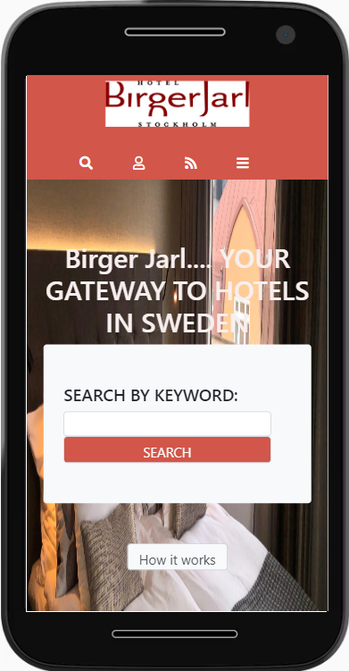

# HTML/CSS capstone project

This project is a capstone project developed as completion of the HTML & CSS section of Microverse main curriculum. It is a responsive website application that helps to find hotels. It is a solo project intended to showcase HTML & CSS Skills. It is a real-world-like project built with some business specifications. It consists of three pages: Home page, search results page, and item details page. The custom CSS of the project is generated using Sass which makes it reusable, readable, and scalable.

## Desktop

## Tablet

## Mobile

## Built With

- HTML,
- CSS
- Sass
- Bootstrap
- jQuery
- JavaScript

## Live Demo

<a href="https://rawcdn.githack.com/tta2yta/directoryhotel/b628b3c08deb78d3d60da412d62f4b5b20a88837/index.html">Live Version</a>

### Setup

To get a local copy up and running follow these simple example steps.

- Go to https://github.com/tta2yta/directoryhotel
- Click on code and copy the html code. 
- Use git bash to clone this repository on your local machine. 
- Run git checkout -b your-braanch-name Make your contributions 
- Push your branch up to your forked repository 
- Open a Pull Request with a detailed description to the development branch of the original project for a review

### Prerequisites 
- VSCode
- Github
- Git

## Author

👤 **Tedros Tesfay**

- Github: [Tedros Tesfay](https://github.com/tta2yta)
- Email: tta2yta@gmail.com

👤

## 🤝 Contributing

Contributions, issues and feature requests are welcome!

Feel free to check the <a href="https://github.com/tta2yta/directoryhotel/issues" target="_blank">issues page</a>.

## Show your support

Give a ⭐️ if you like this project!

## Video Link of the project
<a href="https://www.loom.com/share/3d4f7d216ec94645bc178f106917c89c">Video Link</a>

## Acknowledgments

- <a href="https://www.microverse.org/" target="_blank">microverse.org</a>
- <a href="https://www.behance.net/gallery/24796463/ZATTIX" target="_blank">ZATTIX Mohammed Awad</a>
- <a href="https://www.w3schools.com/" target="_blank">w3schools.com</a>
- <a href="https://www.theodinproject.com/" target="_blank">The Odin Project</a>
- <a href="https://www.stackoverflow.com/" target="_blank">Stackoverflow</a>
- <a href="https://css-tricks.com/" target="_blank">CSS-TRICKS</a>

# directoryhotel
A website application that helps to search hotels.
